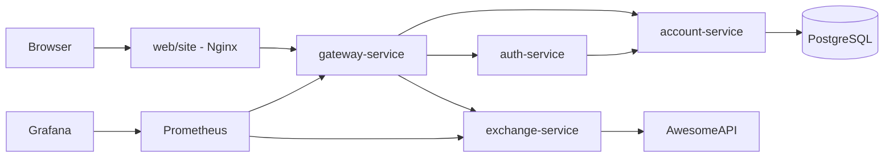
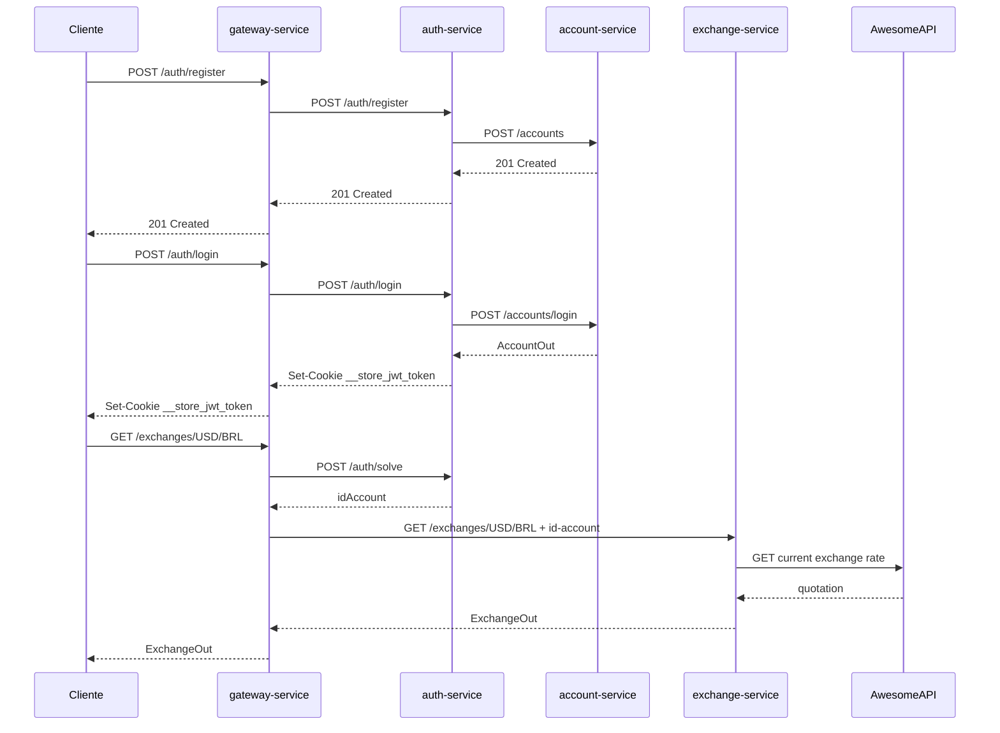
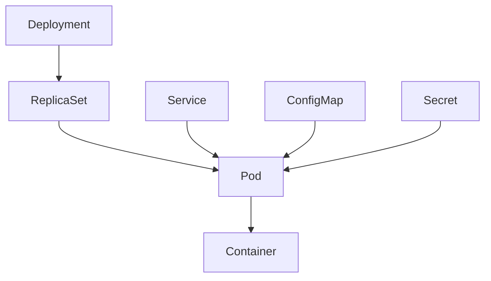

# projeto-exchange

Projeto de microservicos baseado na estrutura do repositorio `pma.261`.
O objetivo desta entrega individual e implementar a **Exchange API** em Python/FastAPI e integra-la com a camada confiavel ja formada por Gateway, Auth e Account.

## Edicao

2026.1

## Grupo

Grupo/Kit: Gatchuscos

Integrantes:

- Gustavo Nicacio: Exchange API
- Vitor Kenzo Nishiwaki Fengler: Order API
- Gabriel Sodré da Costa: Product API

## Entregas (APENAS DO EXCHANGE API)

| Entrega | Data | Status | Observacoes |
|---|---:|---|---|
| Roteiro 1 | 09/05/2026 | Concluído | Estrutura base com submodulos |
| Roteiro 2 | 09/05/2026 | Concluído | Gateway/Auth/Account reutilizados da base |
| Roteiro 3 | 09/05/2026 | Concluído | Exchange API em FastAPI |
| Roteiro 4 | 09/05/2026 | Concluído | Kubernetes, Jenkins e evidencias finais |
| Projeto | 09/05/2026 | Concluído | Integracao local funcional |

## Repositorios

| Repositorio | Papel |
|---|---|
| `projeto-exchange` | Repositorio principal, agrega todos os submodulos |
| `projeto-exchange.account` | Biblioteca Java com DTOs e Feign client de Account |
| `projeto-exchange.account-service` | Microservico Spring Boot de gerenciamento de contas |
| `projeto-exchange.auth` | Biblioteca Java com DTOs e Feign client de Auth |
| `projeto-exchange.auth-service` | Microservico Spring Boot de autenticacao e JWT |
| `projeto-exchange.gateway-service` | API Gateway com validacao de token e roteamento |
| `projeto-exchange.exchange-service` | Microservico Python/FastAPI de cotacao de moedas |
| `projeto-exchange.site` | Frontend estatico servido por Nginx |

## Estrutura

```text
projeto-exchange/
|-- api/
|   |-- account/
|   |-- account-service/
|   |-- auth/
|   |-- auth-service/
|   |-- exchange-service/
|   |-- gateway-service/
|   |-- postgres-service/
|   |-- setup/
|   |-- compose.yaml
|   `-- compose.prod.yaml
|-- web/
|   |-- site/
|   `-- compose.yaml
|-- jenkins/
|   `-- compose.yaml
|-- .gitmodules
`-- README.md
```

## Arquitetura



## Fluxo de Autenticacao



## Exchange API

Endpoint exigido pelo enunciado:

```http
GET /exchanges/{from}/{to}
```

Exemplo:

```http
GET /exchanges/USD/BRL
```

Resposta:

```json
{
  "sell": 5.71,
  "buy": 5.70,
  "date": "2026-05-09 14:23:42",
  "id-account": "0195ae95-5be7-7dd3-b35d-7a7d87c404fb"
}
```

O usuario precisa estar autenticado. A autenticacao e feita pelo `gateway-service`, que valida o cookie JWT com o `auth-service` e injeta o header `id-account` antes de encaminhar a requisicao ao `exchange-service`.

## Bottlenecks Implementados

| Bottleneck | Implementacao | Evidencia |
|---|---|---|
| Caching | Cache em memoria com TTL por par de moedas no `exchange-service` | Reduz chamadas repetidas para a API externa |
| Observability | Endpoint `/metrics` no `exchange-service`, coletado pelo Prometheus | Target `ExchangeMetrics` em `http://localhost:9090/targets` |

## Rodando Localmente

Backend:

```bash
cd api/
docker compose up -d --build
```

Frontend:

```bash
cd web/
docker compose up -d
```

URLs locais:

| Servico | URL |
|---|---|
| Site | `http://localhost:8088` |
| Gateway | `http://localhost:8080` |
| Prometheus | `http://localhost:9090` |
| Grafana | `http://localhost:3000` |

## Testes Manuais

Preflight CORS:

```bash
curl -i -X OPTIONS http://localhost:8080/auth/register \
  -H "Origin: http://localhost:8088" \
  -H "Access-Control-Request-Method: POST" \
  -H "Access-Control-Request-Headers: content-type"
```

Registro:

```bash
curl -i -X POST http://localhost:8080/auth/register \
  -H "Content-Type: application/json" \
  -d '{"name":"Gustavo","email":"gusta@test.com","password":"123456"}'
```

Login:

```bash
curl -i -c cookies.txt -X POST http://localhost:8080/auth/login \
  -H "Content-Type: application/json" \
  -d '{"email":"gusta@test.com","password":"123456"}'
```

Exchange autenticado:

```bash
curl -i -b cookies.txt http://localhost:8080/exchanges/USD/BRL
```

Sem login, o endpoint `/exchanges/USD/BRL` deve retornar `401 Unauthorized`.

## Kubernetes

O microservico `exchange-service` possui manifesto em:

```text
api/exchange-service/k8s/k8s.yaml
```

Recursos definidos:

- `ConfigMap`
- `Secret`
- `Deployment`
- `Service`

Diagrama dos recursos:



## CI/CD

O `exchange-service` possui `Jenkinsfile` com os estagios:

- Dependencies
- Build
- Build & Push Image
- Deploy to K8s

O Jenkins local fica em:

```text
http://localhost:9080
```

## Uso de IA

O uso de IA foi limitado a tarefas de apoio:

- geracao de boilerplate para FastAPI;
- ajustes de Docker, Compose, Jenkins e Kubernetes;
- sugestoes de documentacao;
- auxilio na depuracao de CORS, healthcheck do Postgres e integracao do Gateway.

As decisoes de arquitetura seguiram a estrutura do repositorio base `pma.261`, e o conteudo será revisado pelos integrantes antes da entrega.

## VÍDEO

link quando eu fizer
