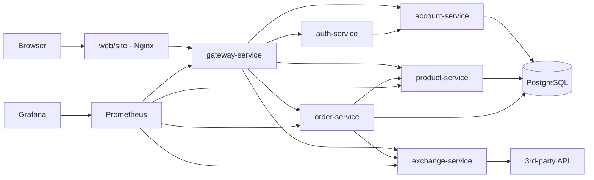

# Projeto Exchange Store

Projeto de microservicos baseado na estrutura do repositorio `pma.261`.

## Grupo

Grupo: Gatchuscos

Integrantes:

- Gustavo Nicacio: Exchange API
- Vitor Kenzo Nishiwaki Fengler: Product API
- Gabriel Sodre da Costa: Order API

## Objetivo

Aplicacao web para compra e venda de produtos com suporte a conversao de moedas. O projeto integra Gateway, Auth, Account, Exchange, Product e Order.

## Repositorios

| Repositorio | Papel |
| --- | --- |
| `projeto-exchange` | Repositorio principal com submodules |
| `account` | Contratos Java de Account |
| `account-service` | Gerenciamento de contas |
| `auth` | Contratos Java de Auth |
| `auth-service` | Registro, login e JWT |
| `gateway-service` | API Gateway e camada confiavel |
| `exchange-service` | Cotacao de moedas em Python/FastAPI |
| `product` | Contratos Java de Product |
| `product-service` | Cadastro e consulta de produtos |
| `order-service` | Criacao e consulta de pedidos em Python/FastAPI |
| `site` | Frontend estatico |

## Arquitetura



## Rodando localmente

Backend:

```powershell
cd api
docker compose up -d --build
```

Frontend:

```powershell
cd web
docker compose up -d
```

URLs:

| Servico | URL |
| --- | --- |
| Site | `http://localhost:8088` |
| Gateway | `http://localhost:8080` |
| Prometheus | `http://localhost:9090` |
| Grafana | `http://localhost:3000` |

## Testes manuais

Registro:

```powershell
curl.exe -i -X POST http://localhost:8080/auth/register `
  -H "Content-Type: application/json" `
  -d "{\"name\":\"Gustavo\",\"email\":\"gusta@test.com\",\"password\":\"123456\"}"
```

Login:

```powershell
curl.exe -i -c cookies.txt -X POST http://localhost:8080/auth/login `
  -H "Content-Type: application/json" `
  -d "{\"email\":\"gusta@test.com\",\"password\":\"123456\"}"
```

Exchange autenticado:

```powershell
curl.exe -i -b cookies.txt http://localhost:8080/exchanges/USD/BRL
```

Product:

```powershell
curl.exe -i http://localhost:8080/products
```

Order:

```powershell
curl.exe -i -b cookies.txt http://localhost:8080/orders
```

## Kubernetes

Cada microservico possui manifesto com `ConfigMap`, `Secret`, `Deployment` e `Service`:

- `api/account-service/k8s/k8s.yaml`
- `api/auth-service/k8s/k8s.yaml`
- `api/exchange-service/k8s/k8s.yaml`
- `api/gateway-service/k8s/k8s.yaml`
- `api/order-service/k8s/k8s.yaml`
- `api/product-service/k8s/k8s.yaml`
- `api/postgres-service/k8s/*.yaml`

Aplicacao no cluster:

```bash
kubectl apply -f api/postgres-service/k8s/
kubectl apply -f api/account-service/k8s/k8s.yaml
kubectl apply -f api/auth-service/k8s/k8s.yaml
kubectl apply -f api/exchange-service/k8s/k8s.yaml
kubectl apply -f api/product-service/k8s/k8s.yaml
kubectl apply -f api/order-service/k8s/k8s.yaml
kubectl apply -f api/gateway-service/k8s/k8s.yaml
```

## CI/CD

Os microservicos possuem `Jenkinsfile` com:

- `Dependencies`
- `Build`
- `Build & Push Image`
- `Deploy to K8s`

O Jenkins local fica em `http://localhost:9080`.

## Bottlenecks

| Bottleneck | Implementacao |
| --- | --- |
| Caching | Cache em memoria no Exchange por par de moedas |
| Observability | Prometheus e Grafana |
| Authentication & Authorization | Gateway valida JWT no Auth |
| Load Balancing | Kubernetes Services e HPA no Gateway |

## Documentacao

MkDocs:

```powershell
mkdocs serve
```

Conteudo principal em `docs/`.

## Uso de IA

IA foi usada como apoio para boilerplate, depuracao, documentacao e revisao de configuracoes. As decisoes e validacoes finais ficam sob responsabilidade dos integrantes.

## Pendencias de evidencia

- Criar cluster EKS e aplicar manifests.
- Rodar Jenkins com deploy no cluster.
- Gravar teste de carga com HPA.
- Preencher links finais de repositorios, Docker Hub, video e apresentacao.
