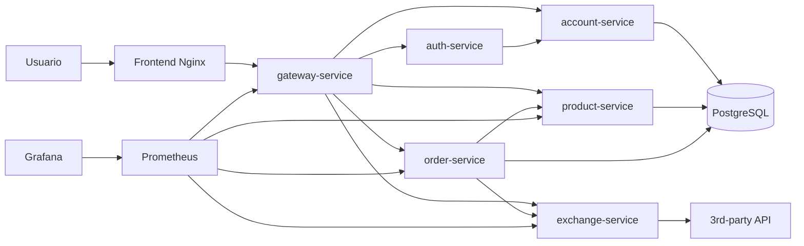
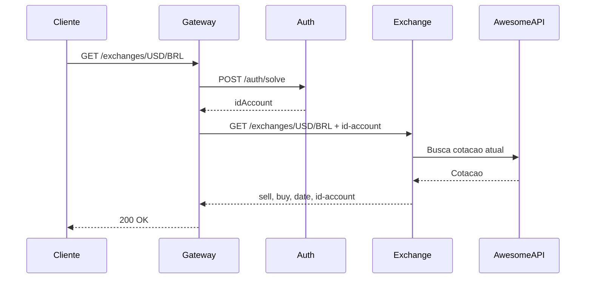

# Arquitetura

## Visao Geral

O projeto segue a estrutura do repositorio base `pma.261`: um repositorio principal agrega submodules de cada microservico, e a comunicacao externa passa pelo Gateway.

## Camada Confiavel

O usuario acessa apenas o frontend e o Gateway. O Gateway valida o cookie JWT com o Auth e repassa o identificador da conta para os servicos internos quando necessario.

## Fluxo autenticado de cotacao

