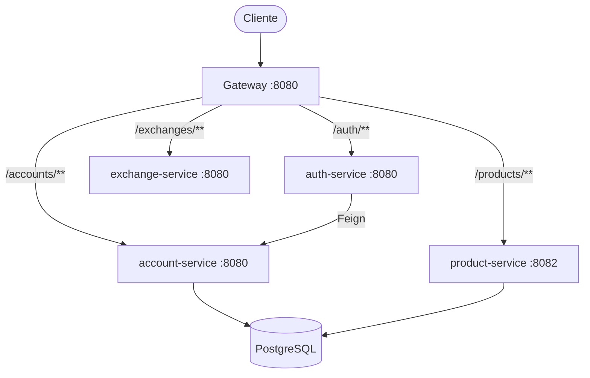
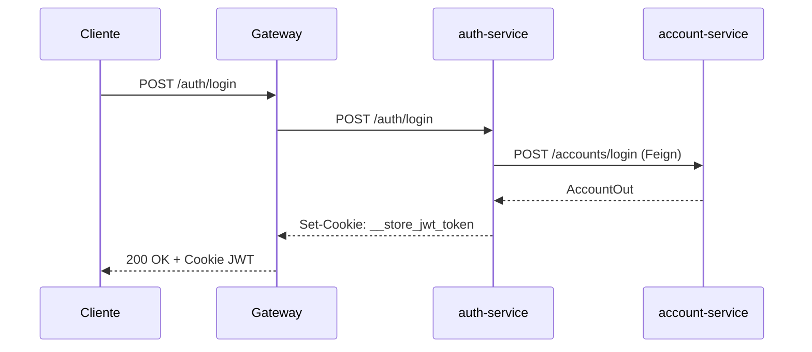
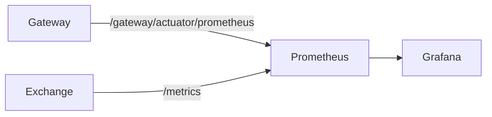

# Arquitetura

## Visão Geral

O sistema segue o padrão de **API Gateway + Microserviços**. Todo o tráfego externo passa pelo gateway, que roteia para os serviços internos via hostname Docker/Kubernetes.



## Serviços

| Serviço | Linguagem | Porta | Responsabilidade |
|---|---|---|---|
| `gateway-service` | Java / Spring Cloud Gateway | 8080 | Roteamento, CORS |
| `auth-service` | Java / Spring Boot | 8080 | Autenticação JWT |
| `account-service` | Java / Spring Boot | 8080 | Gestão de usuários |
| `product-service` | Java / Spring Boot | 8082 | Catálogo de produtos |
| `exchange-service` | Python / FastAPI | 8080 | Conversão de moedas |

## Comunicação entre serviços

- **Externo → Gateway**: HTTP REST via porta `8080`
- **Gateway → Serviços**: roteamento por path via Spring Cloud Gateway
- **Auth → Account**: comunicação interna via **OpenFeign**
- **Banco de dados**: `account-service` e `product-service` conectam ao PostgreSQL via Flyway

## Padrão de contrato

Os serviços Java utilizam um módulo de contrato separado (`account/`, `product/`, `auth/`) que define as interfaces Feign e DTOs compartilhados entre serviços. Isso garante consistência nas chamadas internas.

```
api/
├── account/           # Contrato: interface Feign + DTOs
├── account-service/   # Implementação
├── product/           # Contrato: interface + DTOs
├── product-service/   # Implementação
├── auth/              # Contrato: interface Feign + DTOs
├── auth-service/      # Implementação
├── exchange-service/  # Serviço Python (sem contrato separado)
└── gateway-service/   # Gateway
```

## Autenticação



O token JWT é armazenado em cookie HTTP-only (`__store_jwt_token`). O gateway injeta o header `id-account` nas requisições autenticadas para que os serviços downstream saibam o usuário logado.

## Observabilidade



- **Prometheus** coleta métricas a cada 1 segundo
- **Grafana** exibe dashboards em `http://localhost:3000`
- **Prometheus UI** disponível em `http://localhost:9090`
