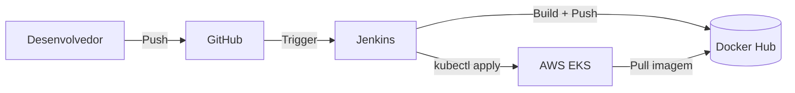

# AWS

A infraestrutura de produção do projeto é hospedada na AWS, com o pipeline de CI/CD gerenciado pelo Jenkins integrado ao EKS e ao Docker Hub.

## Serviços utilizados

| Serviço | Uso |
|---|---|
| **EKS** | Orquestração dos microserviços em produção |
| **EC2** | Nodes do cluster EKS + servidor Jenkins |
| **Docker Hub** | Registro das imagens Docker (público) |

## Fluxo de deploy



## Ambiente de produção vs desenvolvimento

| Aspecto | Desenvolvimento | Produção |
|---|---|---|
| Orquestração | Docker Compose | Kubernetes (EKS) |
| Banco de dados | PostgreSQL local | PostgreSQL no K8s |
| Imagens | Build local | Docker Hub (`latest` + `BUILD_ID`) |
| Configurações | `.env` | ConfigMap + Secrets K8s |
| Plataformas | Nativa da máquina | `linux/amd64` + `linux/arm64` |

## Compose de produção

O arquivo `compose.prod.yaml` permite rodar o ambiente de produção usando as imagens já publicadas no Docker Hub, sem precisar compilar o código:

```bash
docker compose -f compose.prod.yaml up -d
```

Serviços disponíveis no compose de produção:

- `db` — PostgreSQL 18
- `account` — `humbertosandmann/account:latest`
- `exchange` — `projetomicro/exchange:latest`
