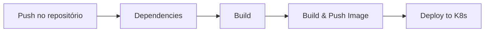

# CI/CD

O pipeline de CI/CD é gerenciado pelo **Jenkins**, rodando em um container Docker com suporte a builds multi-plataforma (amd64 e arm64) e deploy direto no Kubernetes.

## Infraestrutura do Jenkins

O Jenkins é provisionado via Docker Compose na pasta `jenkins/`:

```yaml
services:
  jenkins:
    image: jenkins/jenkins:jdk25
    ports:
      - 9080:8080  # UI acessível em http://localhost:9080
```

A imagem customizada já vem com todas as ferramentas instaladas:

| Ferramenta | Uso |
|---|---|
| Maven | Build dos serviços Java |
| Python 3 + pip | Build do exchange-service |
| Docker + Buildx | Build e push de imagens multi-plataforma |
| kubectl | Deploy no cluster Kubernetes |
| AWS CLI | Integração com AWS (EKS, ECR) |

Para subir o Jenkins:
```bash
cd jenkins/
docker compose up -d --build
```

## Pipeline por serviço

Cada serviço tem seu próprio `Jenkinsfile`. O fluxo geral é:



### Serviços Java (account-service)

```
1. Dependencies  → compila o módulo de contrato compartilhado (account)
2. Build         → mvn -B -DskipTests clean package
3. Build & Push  → docker buildx (linux/amd64 + linux/arm64)
                   push para Docker Hub: humbertosandmann/account:latest
```

### Serviços Python (exchange-service)

```
1. Dependencies  → python3 -m venv + pip install -r requirements.txt
2. Build         → python -m compileall app
3. Build & Push  → docker buildx (linux/amd64 + linux/arm64)
                   push para Docker Hub: projetomicro/exchange:latest
4. Deploy to K8s → kubectl apply -f k8s/k8s.yaml
```

## Imagens Docker Hub

| Serviço | Imagem |
|---|---|
| account-service | `humbertosandmann/account:latest` |
| exchange-service | `projetomicro/exchange:latest` |

As imagens são tagueadas com `:latest` e também com o `BUILD_ID` do Jenkins para rastreabilidade.

## Credenciais

O Jenkins usa a credencial `dockerhub-credential` (configurada na UI do Jenkins) para autenticar no Docker Hub durante o push das imagens.
