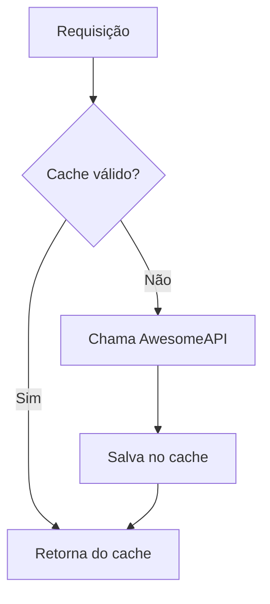

# Exchange API

**Responsável** -> Gustavo Nicacio

**Repositório**: [Repositório exchange](https://github.com/projeto-micro/projeto-exchange.exchange-service.git) 

Serviço responsável pela conversão de moedas entre pares de divisas.

- **Linguagem:** Python + FastAPI
- **Porta interna:** `8080`
- **Base path via gateway:** `/exchanges`

## Configuração

| Variável | Padrão | Descrição |
|---|---|---|
| `EXCHANGE_PROVIDER_URL` | `https://economia.awesomeapi.com.br/json/last/{from_currency}-{to_currency}` | URL do provedor externo |
| `EXCHANGE_CACHE_TTL_SECONDS` | `60` | Tempo de cache da cotação em segundos |
| `EXCHANGE_REQUEST_TIMEOUT_SECONDS` | `5` | Timeout da requisição ao provedor |

## Endpoints

### `GET /exchanges/{from_currency}/{to_currency}` — Converter moeda

Retorna a cotação entre dois pares de moeda. Requer o header `id-account` com o ID do usuário autenticado.

**Headers obrigatórios:**

| Header | Descrição |
|---|---|
| `id-account` | ID da conta do usuário autenticado |

**Path params:**

| Param | Descrição | Exemplo |
|---|---|---|
| `from_currency` | Moeda de origem (ISO 3 letras) | `USD` |
| `to_currency` | Moeda de destino (ISO 3 letras) | `BRL` |

**Exemplo:** `GET /exchanges/USD/BRL`

**Resposta:** `200 OK`
```json
{
  "sell": 5.87,
  "buy": 5.85,
  "date": "2024-01-15 10:30:00",
  "id-account": "uuid-da-conta"
}
```

| Campo | Tipo | Descrição |
|---|---|---|
| `sell` | `float` | Preço de venda (ask) |
| `buy` | `float` | Preço de compra (bid) |
| `date` | `string` | Data da cotação |
| `id-account` | `string` | ID da conta que fez a consulta |

**Caso especial:** se `from_currency == to_currency`, retorna `sell: 1.0` e `buy: 1.0` sem chamar o provedor.

---

### `GET /health-check` — Health check

**Resposta:** `200 OK`
```json
{ "status": "ok" }
```

---

### `GET /info` — Informações do serviço

**Resposta:** `200 OK`
```json
{
  "application": "exchange-service",
  "framework": "FastAPI",
  "status": "running"
}
```

---

### `GET /metrics` — Métricas Prometheus

Expõe métricas no formato Prometheus para coleta pelo servidor de monitoramento.

## Cache

As cotações são cacheadas **em memória** por `EXCHANGE_CACHE_TTL_SECONDS` segundos (padrão: 60s). Isso reduz chamadas ao provedor externo e melhora a latência.



## Validações e erros

| Situação | Status |
|---|---|
| Código de moeda inválido (não são 3 letras) | `400 Bad Request` |
| Par de moedas não encontrado no provedor | `404 Not Found` |
| Provedor externo recusou a requisição | `502 Bad Gateway` |
| Provedor externo indisponível ou timeout | `502 Bad Gateway` |
| Payload inválido retornado pelo provedor | `502 Bad Gateway` |

## Provedor externo

O serviço consome a [AwesomeAPI](https://economia.awesomeapi.com.br) para obter cotações em tempo real. A URL do provedor é configurável via variável de ambiente, permitindo trocar a fonte sem alterar o código.

# Vídeo funcionando

[Assista ao vídeo de demonstração](https://youtu.be/Y97KsvTqPqk)

<iframe width="1030" height="579" src="https://www.youtube.com/embed/Y97KsvTqPqk" title="Exchange funcional" frameborder="0" allow="accelerometer; autoplay; clipboard-write; encrypted-media; gyroscope; picture-in-picture; web-share" referrerpolicy="strict-origin-when-cross-origin" allowfullscreen></iframe>

